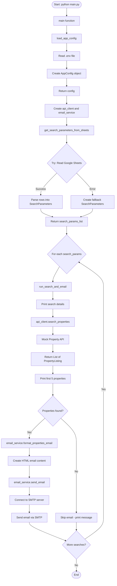

## Application Flow Diagram

This Mermaid diagram shows the high-level flow of the application from configuration loading through Google Sheets, property search, and email sending.

```mermaid
flowchart TD
    Start([Start: python main.py]) --> Main[main function]
    
    Main --> LoadConfig[load_app_config]
    LoadConfig --> ReadEnv[Read .env file]
    ReadEnv --> CreateConfig[Create AppConfig object]
    CreateConfig --> ReturnConfig[Return config]
    
    ReturnConfig --> CreateClients[Create api_client and email_service]
    
    CreateClients --> GetSheets[get_search_parameters_from_sheets]
    
    GetSheets --> TrySheets{Try: Read Google Sheets}
    TrySheets -->|Success| ParseRows[Parse rows into SearchParameters]
    TrySheets -->|Error| Fallback[Create fallback SearchParameters]
    ParseRows --> ReturnList[Return search_params_list]
    Fallback --> ReturnList
    
    ReturnList --> LoopStart{For each search_params}
    
    LoopStart --> RunSearch[run_search_and_email]
    RunSearch --> PrintDetails[Print search details]
    PrintDetails --> CallAPI[api_client.search_properties]
    
    CallAPI --> MockAPI[Mock Property API]
    MockAPI --> ReturnProperties[Return List of PropertyListing]
    
    ReturnProperties --> PrintResults[Print first 5 properties]
    PrintResults --> CheckProperties{Properties found?}
    
    CheckProperties -->|Yes| FormatEmail[email_service.format_properties_email]
    CheckProperties -->|No| SkipEmail[Skip email - print message]
    
    FormatEmail --> CreateHTML[Create HTML email content]
    CreateHTML --> SendEmail[email_service.send_email]
    SendEmail --> SMTP[Connect to SMTP server]
    SMTP --> Send[Send email via SMTP]
    
    Send --> NextSearch{More searches?}
    SkipEmail --> NextSearch
    NextSearch -->|Yes| LoopStart
    NextSearch -->|No| End([End])
```

